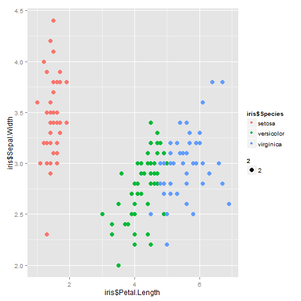

SVM example using Fisher's Iris Data
========================================================
author: Andy Johnson
date: 1/25/2015

Key Points
========================================================

- This Shiny app lets the user explore the application of a Support Vector Machine (SVM) classification algorithm using the classic Fisher's iris dataset. 

- SVM's are classification algorithms that can create complex decision boundaries by using a variety of kernel functions.

- We will employ a SVM to classify different flower species found in Fisher's iris dataset.

Data
========================================================

Fisher's iris data describes petal and sepal dimensions of three species of iris. This dataset is commonly used to illustrate the use of classification models, as the dimensional characteristics are distinct between the three species. 
<small style="font-size:.7em">

```r
str(iris)
```

```
'data.frame':	150 obs. of  5 variables:
 $ Sepal.Length: num  5.1 4.9 4.7 4.6 5 5.4 4.6 5 4.4 4.9 ...
 $ Sepal.Width : num  3.5 3 3.2 3.1 3.6 3.9 3.4 3.4 2.9 3.1 ...
 $ Petal.Length: num  1.4 1.4 1.3 1.5 1.4 1.7 1.4 1.5 1.4 1.5 ...
 $ Petal.Width : num  0.2 0.2 0.2 0.2 0.2 0.4 0.3 0.2 0.2 0.1 ...
 $ Species     : Factor w/ 3 levels "setosa","versicolor",..: 1 1 1 1 1 1 1 1 1 1 ...
```
</small>

Fisher's Iris Data
========================================================

As an example, this plot shows how the three iris species differ according to two of their flower dimensions: 
 

Support Vector Machine algorithms
========================================================

A Support Vector Machine (SVM) is a supervised classification algorithm that attempts to identify a separating hyperplane between the identified classes. It can use a variety of kernel functions to transform the original problem space into higher dimensions. 

The kernel functions available here include:
- linear
- radial
- polynomial

Using this Shiny App
========================================================

- To use this Shiny App, first select the kernel function type, followed by the flower petal and sepal dimensions desired. 
- The SVM model will automatically run, and a plot of the two chosen dimensions will be displayed. The plot shows the observations from all three species (color-coded by type), along with the SVM-derived classification boundaries.
